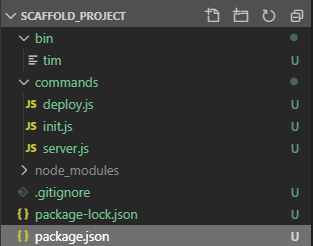
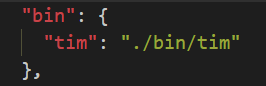

--- 
title: 前端工程化系列之闲谈“脚手架”（下）
sidebar: auto
sidebarDepth: 3
date: 2019-10-21
categories: 
 - 前端
 - 工程化
tags: 
 - 工程化
 - 前端
---

:::tip
如何自己构建实现一个简单功能的脚手架
:::
<!-- more -->
**Version：2019.10.21.v1.6**

## 开篇

大家好，我是王小胖，一个集可爱与智慧于一身的胖子。

首先很抱歉这篇拖了一个多月才出来，因为不仅因为这期间经历了两个假期的原因，还有这篇文章因为不算“扯淡”文，纯技术点相关的分享， 所以一直想尽量广而全，完美一点，至少得胖子自己满意，后来发现太难了。。。做到易读和有货确实太难了，现在很佩服写原创技术书籍的大神啊 ；）


今天，我们看看如何自己构建实现一个简单功能的脚手架：
**1.初始构建功能**
通过这个基本功能实现，可以了解脚手架中关于命令行解析，简单文件操作。

**2.本地live reload开发**
对浏览器端和node端live reload开发环境的实现，给一个简单介绍，做一个简单的实现。

## 介绍

**首先简单介绍下我们这篇文章关于脚手架构建要介绍的一些技术实现：**

1. 命令行解析相关
2. git download
3. 文件操作
4. 浏览器端Live Reload/Watch 本地开发
5. Node端Live Reload/Watch 本地开发

**将会使用的库/Lib**
```json
"dependencies": {
    "@angular/cli": "^8.3.5",
    "chalk": "^2.4.2",
    "chokidar": "^3.2.2",
    "commander": "^3.0.1",
    "download-git-repo": "^2.0.0",
    "inquirer": "^7.0.0",
    "ora": "^4.0.0"
  }
```
## 构建

### 0.项目结构和依赖
首先我们初始化我们的工程，npm init和npm install就不多说了，当然也可以自己全手工创建。
”bin“目录里存放的是脚手架的入口文件
”commands“目录存放的是每个命令的处理文件

看看我们的项目的文件结构



### 1.创建入口文件
在bin目录下创建一个tim（胖子英文小名）并没有后缀的文件，作为执行文件的入口，并在package.json中配置执行命令。



再来看看bin/tim文件，这个文件就是利用commander来实现一些命令入口。
"#!/usr/bin/env node"就是为了让系统可以动态的去查找node来执行脚本文件。

```js
#!/usr/bin/env node
const program = require('commander');

program.version(require('../package').version)
    .usage('<command> [options]')
    .description('Welcome to Tim Scaffold demo project...');    

program.command('init')
    .alias('i')
    .option('-o, --options', 'init option...')
    .description('Generate a new project')
    .action(require('../commands/init'));

program.command('server')
    .alias('s')
    .option('', '')
    .description('Start dev server...')
    .action(require('../commands/server'));

program.command('deploy')
    .alias('d')
    .option('', '')
    .description('testing...')
    .action(require('../commands/server'));

program.parse(process.argv);

//show help tips.
if (!program.args.length) {
    program.help();
}
```

### 2.创建初始化命令
使用inquirer实现命令行的问答交互模式。实现用户配置项目名，选择想使用的项目模板，是AngularJS还是VueJS。胖子这里会选用两种不同的模板生成方式供大家参考。
```js
const program = require('commander');
const { prompt } = require('inquirer');
const spawnSync = require('child_process').spawnSync;
const gitDownload = require('download-git-repo');
const fs = require('fs');

const templateList = ['VueJS', 'AngularJS'];
const questions = [
    {
        type: 'input',
        name: 'name',
        message: 'Project Name',
        default: 'scaffold_demo_project',
        filter(val) {
            return val.trim();
        },
        validate(val) {
            //Add your validation logic
            return true;
        },
        transformer(val) {
            return val;
        }
    }, {
        type: 'list',
        name: 'template',
        message: 'Project template',
        choices: templateList,
        default: templateList[0],
        validate(val) {
            //Add your validation logic
            return true;
        },
        transformer(val) {
            return val;
        }
    }
];

function genAngularProject(projectName) {
}

function genVueProject(projectName) {
}

function updatePackageInfo(projectName) {
}

module.exports = function() {
    console.info('init...');
    var projectName = 'tim-scaffold-demo';
    var templateName = '';

    prompt(questions).then((data) => {
        projectName = data.name;
        templateName = data.template;
        if (templateName === 'VueJS') {
            genVueProject(projectName);
        } else {
            genAngularProject(projectName);
        }
    });
}
```
通过angular CLI来生成项目模板。这里使用spawnSync来执行内部的npm和ng的命令操作。

```js
function genAngularProject(projectName) {
    console.info('Start genarate Angular Project...');

    const cmdSuffix= process.platform === 'win32' ? '.cmd': '';

    const npminstallResult = spawnSync('npm' + cmdSuffix, ['install', '@angular/cli', '-g'], {
        stdio: 'inherit'//import setting...
    });

    console.debug(npminstallResult);

    if (npminstallResult.status === 0) {
        console.info('Install @angular/cli successfully...');
    } else {
        console.error('Install @angular/cli failed...');
        console.error(npminstallResult.error);
    }

    console.info('Start generate new Angular project...');

    const ngNewResult = spawnSync('ng' + cmdSuffix, ['new', projectName], {
        stdio: 'inherit'//import setting...
    });

    console.debug(ngNewResult);

    if (ngNewResult.status === 0) {
        updatePackageInfo(projectName);
        console.info('Generate new Angular success...');
    } else {
        console.error('Generate new Angular failed...');
        console.error(ngNewResult.error);
    }
}
```
通过gitDownload实现git下载，来生成VueJS模板。
```js
function genVueProject(projectName) {
    console.info('Start download VueJS template project...');

    gitDownload('direct:https://github.com/MillerRen/vue-boilerplate.git', `./${projectName}`, { clone: true }, function (err) {
        if (err) {
            console.log(err);
            console.error('Generate new VueJS failed...');
            return;
        }
        updatePackageInfo(projectName);
        console.info('Generate new VueJS success...');
    })
}
```
基本的模板生成后，通过更新模板里的package.json文件配置信息实现自己项目的定制化，胖子这里就简单实现项目名的修改。

```js
function updatePackageInfo(projectName) {
    const fileName = `./${projectName}/package.json`;
    const jsonString = fs.readFileSync(fileName);
    const jsonFile = JSON.parse(jsonString)

    jsonFile.name = projectName;

    fs.writeFile(fileName, JSON.stringify(jsonFile, null, 2), function(err) {
        if(err) {
            console.error('Update package info error...');
            return
        }

        console.info('Update package info success...');
    });
}
```
## 3.live reload/HRM

提到live reload/HRM，大家可能觉得这东西对我们实用性不大，为啥还要讲呢？胖子这里想说，因为目前基本所有的脚手架项目都会具备这个功能，大家应该都或多或少了解或使用过，只是因为它太不起眼，被大家忽视了，不过胖子觉得我们应该做到“知其言并知其所以言”，了解它的实现原理。这样大家就可以在需要的时候，实现自己定制化的功能了。有人可能会说，其实也没节省多少时间啊，就几秒而已啊，有需要，自己刷新页面或重启一下服务不就好了，何必费劲用live reload/HRM？但是如果要是大家接触的是大型且复杂的前端项目，更新和编译有可能花费更长的时间，并不是一个好的开发体验，另外对于一个团队来说，更快速和更好的开发体验是十分重要的（如果做开发平台的，肯定深有感触）。

首先咱们先了解一下市面上已有的一些live reload实现。其实live reload在前端好久之前就已经有项目开始采用了，胖子接触的像Gulp-livereload，Browsersync，webpack livereload，另外还有一些Chrome和Firefix live reload 插件。对于这些今天就不一一介绍了，胖子这回就针对自己接触和了解的前端浏览器端和nodeJS端的live reload实现做一些简单介绍。

其实live reload，简单了说，就是监控文件改动，识别改动，实现重新加载。

### 浏览器端开发live reload：
我们这里主要说说webpack相关的live reload，其实跟webpack相关的，前后胖子也简单接触到一些，像web-dev-server，webpack-hot-middleware，web-serve等等。下面简单介绍一下，大家如果想深入研究，大家可以自行在网上搜索相关的说明文档

#### webpack-dev-server
[https://github.com/webpack/webpack-dev-server](https://github.com/webpack/webpack-dev-server)
webpack-dev-server是一个独立的nodejs静态服务器，node端利用中间件实现与webpack的结合，实现构建打包输出，自动刷新，热更新（HRM）等功能。

#### webpack-hot-middleware
[https://github.com/webpack-contrib/webpack-hot-middleware](https://github.com/webpack-contrib/webpack-hot-middleware)
webpack-hot-middleware是一个在webpack-dev-middleware基础上搭建的实现热更新的中间件。

#### webpack-serve
[https://github.com/webpack-contrib/webpack-serve](https://github.com/webpack-contrib/webpack-serve)
项目已经是Deprecated淘汰状态，所以大家有兴趣和时间再简单了解

这里如果大家只是开发纯前端的静态文件，且没有已有的static server，可以直接使用webpack-dev-server；如果大家之前已经把静态文件部署到node server上，想增加live reload或HRM的支持，可以使用上面提到的middleware，虽然目前看这些都是基于Express开发的中间件，但是如果您使用了其他的node web server的相关库，可以在github上寻找是否有人做出了对应的webpack node中间件，向之前胖子就查找过Koa相关的webpack中间件，确实有，而且质量还不错的。

### Nodejs端开发live reload：

NodeJs端的live reload，其实原理和前面的浏览器端的原理一样，也是监听文件改动，识别改动，实现重启加载。这里胖子简单介绍一下简单易用的工具供大家参考。

#### nodemon
[https://github.com/remy/nodemon](https://github.com/remy/nodemon)
nodemon的作用可以在不修改任何代码的情况下，监测node文件的改动，自动重启服务，简单易用。

#### pm2
[http://pm2.keymetrics.io/](http://pm2.keymetrics.io/)
pm2是nodejs进程的管理工具，本身不光只有live reload，它也包含性能监控，负载均衡等等。对于live reload，大家只需使用pm2启动node服务时候增加“-watch”参数即可。

对于现在正火的typescript，nodemon结合ts-node，就可以对typescript编写的node代码实现同样的live reload功能了。

另外大家可以使用node-dev或者ts-node-dev。相关github地址如下：
[https://github.com/TypeStrong/ts-node](https://github.com/TypeStrong/ts-node)
[https://github.com/whitecolor/ts-node-dev](https://github.com/whitecolor/ts-node-dev)

掌握了这些，我们发现live reload毕竟还需要重新启动node服务，有没有啥方式能像webpack的HRM一样，实现热更新呢，我们来试一试。

实现的思路和前面提到浏览器端的实现思路大体是一样的--监控文件改动，文件改动后用新的文件模块覆盖旧的。我们只需要将这段实现代码加到我们自己脚手架node实现的web server工程目录下就可以了。

文件监控，我们使用的是chokidar。
更新nodejs文件模块，关键字“require.cache”,大家可以自行搜索了解一下。
```js
const chokidar = require('chokidar')；
const watcher = chokidar.watch('./app')；
watcher.on('ready', function() {
  watcher.on('all', function() {
    Object.keys(require.cache).forEach(function(id) {
      if (/[\/\\]app[\/\\]/.test(id)) delete require.cache[id]；
    })
  })
})
```
上面的代码只是“最最”简单的实现，其实还有很多的方面可以做来完善这个功能，比如文件监测的防抖动处理，文件目录的自动查找，文件模块的高效匹配。另外因为对软件产品的可靠性高要求，NodeJS端热更新和热部署，目前看只适用于开发阶段或测试阶段。

## 结语

胖子希望这三篇关于前端“脚手架”的文章，对大家能有些许的帮助。这篇文章完成之后，胖子也对这个公众号的维护有了一些总结和想法，之后会以新的形式来为大家服务。

**如果您有什么问题和建议，欢迎留言。
转载请注明 码农王小胖**