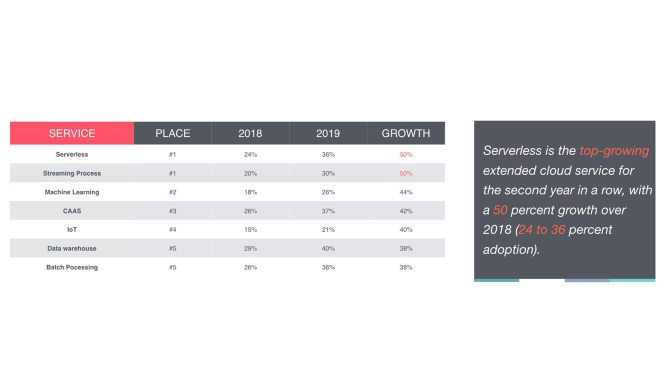
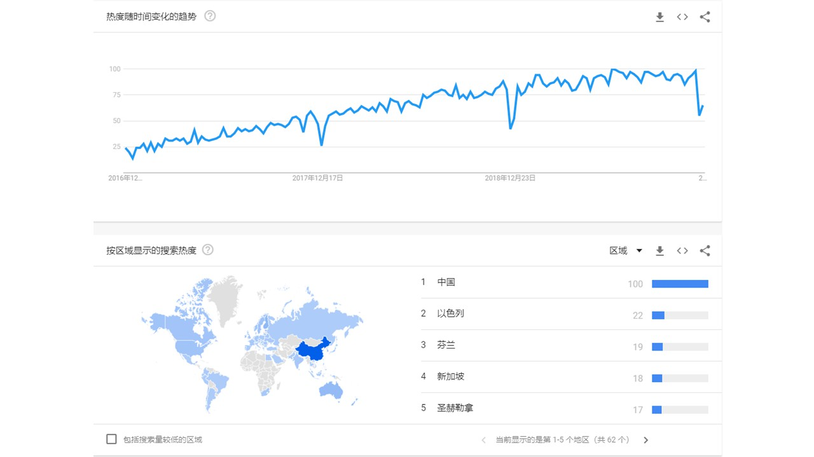
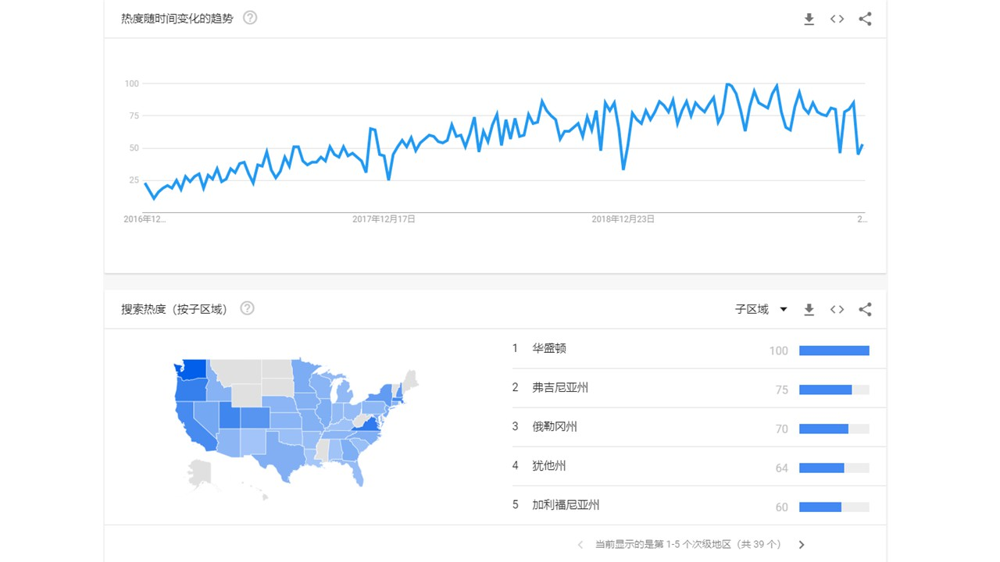
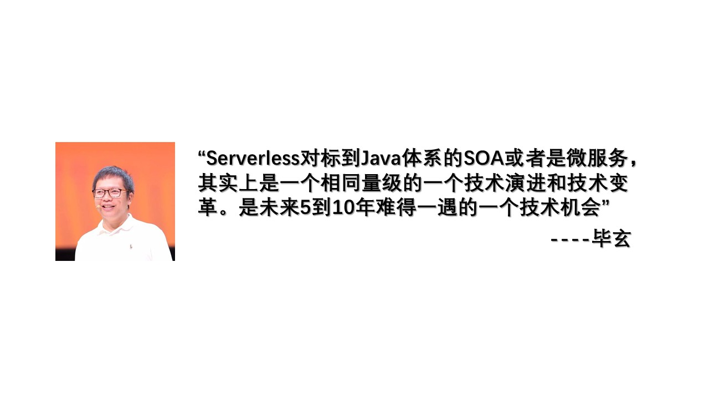
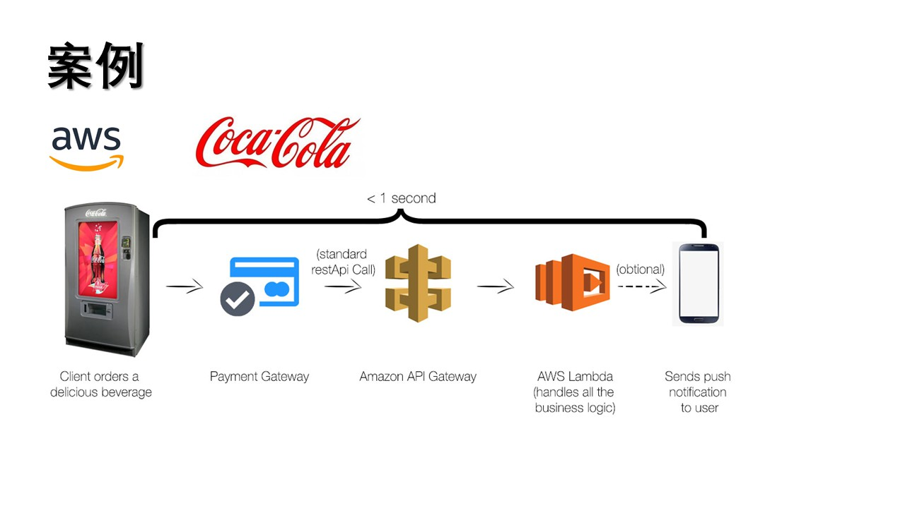
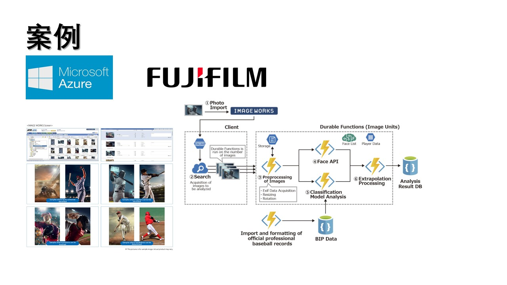
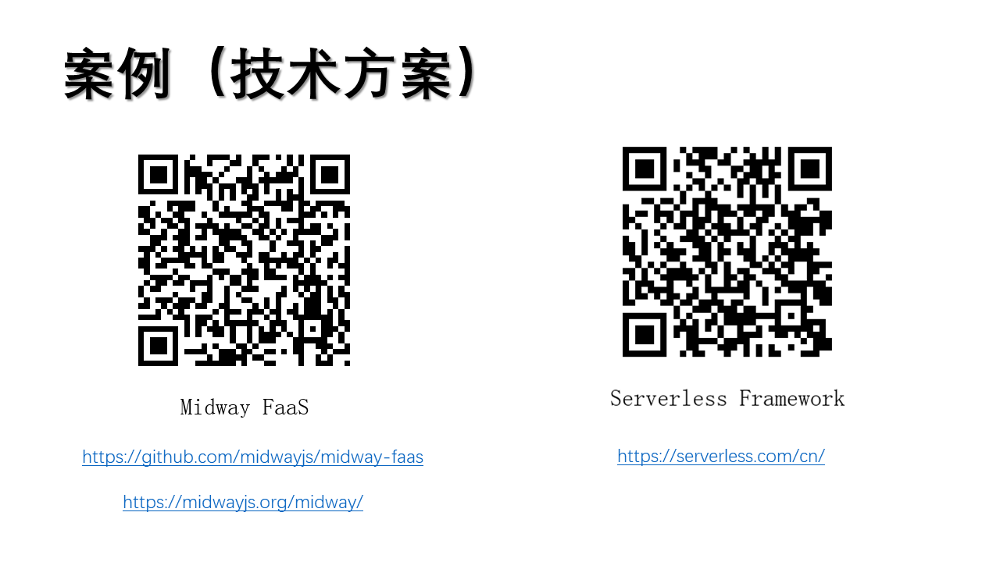

--- 
title: 小胖说“码”之Serverless初级调研报告
sidebar: auto
sidebarDepth: 3
date: 2020-01-20
categories: 
 - 前端
 - Serverless
 - 架构
tags: 
 - 前端
 - Serverless
 - 架构
 - 调研报告
---

:::tip
相信大家在最近两三年，无论是在网络上，公众号上，技术社区论坛，还是各种云相关，架构相关的技术大会上，甚至是前端技术大会上，都会听到一个词 — “Serverless”。这次《小胖说“码”》就和大家聊聊如今大热的Serverless。
:::
<!-- more -->
** Version：2020.01.20.v1.0 **

## 开篇

大家好，我是王小胖，一个集可爱与智慧一身的胖子。

相信大家在最近两三年，无论是在网络上，公众号上，技术社区论坛，还是各种云相关，架构相关的技术大会上，甚至是前端技术大会上，都会听到一个词 — “Serverless”。这次《小胖说“码”》就和大家聊聊如今大热的Serverless。

------

## Serverless热度
为什么大家都在讨论Serverless呢？我们先来看看Serverless究竟热到什么程度，首先参考《RightScale 2019 年云状态报告》，具2019年统计，Serverless 是云服务平台中增速最快的服务之一，对照2018年达到 50% 的增速。

------
我们再从谷歌热词趋势看，3年来，从全球趋势看，Serverless 一直处于上升的趋势，由此可以看出技术圈对 Serverless 的追捧。

------
再来看看美国关于serverless热度趋势，近3年来，serverless趋势在美国也是稳步增长的。

------
因为刚才我们也看到了Serverless的google趋势图中国区是很热的，所以咱们看看国内的情况。

因为胖子一直关注前端，咱就说说前端，近两三年，就胖子参加的和关注的前端技术大会而言，基本都会有Serverless的专题，注意！不是一个小分享session，是“专题”分会场。所以胖子觉得Serverless在国内的技术圈里，已经是一个“热点”领域了。和码农朋友们闲扯技术，你不知道Serverless，都不好意思跟人打招呼。

胖子同时也注意到，国内两大技术体系，阿里和腾讯，对于serverless的关注，也不单单是两三年前的调研和边缘项目阶段了，如今已经有很多实际业务项目落地，并且由于各自云平台的战略，已经为了争取客户，各自对Serverless领域的投入都在逐渐增大。这些都是可以从18年到19年各个前端技术大会和论坛中，这两个公司技术部门对于Serverless专题分享的内容上可以看出来的。

胖子这里引用一下阿里的基础设施负责人毕玄大神对于Serverless的一个评价来表诉胖子对Serverless的看法。“Serverless对标到Java体系的SOA或者是微服务，其实上是一个相同量级的一个技术演进和技术变革。是未来5到10年难得一遇的一个技术机会”。是的，Serverless是难得一遇的技术机会。

------
## Serverless是什么
既然Serverless火了，我们就来看看Serverless到底是什么？

Serverless 普遍的理解是“无服务器架构”。它不是什么具体的技术，工具或编程框架。它其实是在云服务遍地开花的大背景下，产生的一种新式软件架构设计思想。

所谓“无服务器”，不是说Serverless就神奇的不需要基础的物理服务器，“无服务器”指的是用户不必关心应用运行和运维的管理，提高交付能力，降低工作成本。

**在CNCF的定义里，简单来说，Serverless就是 FaaS + BaaS**

什么是FaaS 和BaaS呢？

这些年，关心技术的大家应该一定都听过各种(X)aaS

* 基础架构即服务（Infrastructure as a Service， IaaS）
* 平台即服务（Platform as a Service，PaaS）
* 软件即服务（Software as a Service，SaaS）
* 函数即服务（Function as a Service，FaaS）
* 后台即服务（Backend as a Service，BaaS）

这些都是基于云计算而产生的概念，那么什么是FaaS和BaaS呢?

**函数即服务（Function as a Service，FaaS）FaaS（Function-as-a-Service）**

用户无需搭建基础服务系统，也不用构建传统的应用，只需要上传自己的函数，配置触发器、路由，函数就能运行工作了。一般FaaS都会支持多种编程语言，如 Java、NodeJS 及 Python 等。

但是单独的FaaS是没有能力独立支撑一个应用平台的运行的，没有了存储，数据库，日志等一些基本服务的支持，FaaS应用场景会被限制的很小。所以FaaS需要BaaS支持。

**后台即服务（Backend as a Service，BaaS）**

因为前面提到的原因，BaaS（后台即服务）也被归入到Serverless 范畴内。通过 BaaS 提供第服务，像数据库、消息队列、日志及存储。但不需要关心这些服务的运维。

------
我们回到Serverless的定义，来看看一篇来自美国加州大学伯克利分校关于Serverless computing的论文摘要里的一句话。 

***“Serverless provides an interface that greatly simplifies cloud programming, and represents an evolution that parallels the transition from assembly language to high-level programming languages.”***

胖子简单地意译一下，Serverless 对传统云平台，云计算给开发者带来的便利，就好像高级语言相对汇编语言给开发者带来的便利一样，高级语言让开发者不用再关心底层的东西，Serverless同样让开发者不用关心云平台与云计算一些底层的东西（甚至是传统开发链路上必不可少的东西，比如运维），实现快速地给开发者业务赋能。

------

## Serverless的特点
说完Serverless的概念，我们再来看看Serverless的特点。基本上业内都会提到的下面三个特点。低成本，无运维，高效能。注意胖子在这三个特点上加了引号，我们来具体看看。

* **“低成本**”使用 Serverless 成本很低，因为我们只需要为每次函数的运行付费。函数通过事件驱动唤醒的方式实现按需加载，按使用量付费。但这也不是绝对的，比如对于传统业务迁移到Serverless解决方案，前期的过度阶段，会经历一段成本增高的时期，比如两套平台需要同时支持，所以成本曲线不会是平滑下降的。
* **“无运维”** 用 Serverless 我们不需要关心运维，主要是交付给公有平台管理，像上线前的自动部署啊，上线后的自动弹性伸缩支持高可用啊，都是Serverless的特色，这也是 Serverless 的核心。不过胖子觉得就目前的一些实际使用情况来看，Serverless应该是“低运维”，因为我们还避免不了一部分运维开发工作来支持Serverless落地，但随着Serverless模式和各大云平台的逐渐成熟，Serverless肯定会慢慢演进到最后无运维的阶段。
* **“高效能”** 谓高效能，是Serverless在依托于FaaS这个基础，使得整个的研发链路变得十分轻量和高效。但是为什么胖子也要在“高效能”上加上引号呢？这是因为目前这个高效能前提是基于Serverless和所服务的业务必须高度适配，如果业务不适配Serverless模式，比如传统业务项目的升级，或者复杂度很高业务的迁移，在这个过程，Serverless相对于其他的开发模式可能就没有那么高效了。

------
## Serverless不足和局限性

对于软件行业来说，没有完美无缺万能的解决方案，Serverless也是。咱们来看看它的一些不足和局限性。

**云厂商绑定Serverless**
应用的实现在很大程度上依赖于云平台上的 FaaS 和 BaaS 服务，且目前 Serverless 领域尚没有形成有关的行业标准。不同厂商的解决方案虽然大体设计思路一致，但是很多具体的细节是不一样的，这就带来了将来跨平台Serverless移植成本高的问题。

**冷启动性能**
性能，一直是每一个公司对于服务service考核的一个重要指标。由于Serverless事件驱动，按需加载的特性，Serverless就摆脱不了一个服务冷启动的性能问题。服务的首次加载可能会产生一定的延时。

**底层黑盒**
之前我们提过Serverless因为让我们不用关心底层的一些东西，带来了便利性，但同时这个优点也带给我们对底层资源的把控有限制，我们对于这部分资源的可控程度基本是一个黑盒的。基于serverless的特点，注定使我们对底层的了解和把控不足，比如底层资源的调配，系统的安全性，我们是能有一定的调控，但是很有限，大部分主要还是依托于基础的公共云平台。

**成熟度和学习成本**
Serverless 一门新兴技术理念和思想，目前 Serverless 相关的平台、工具和框架还处在一个不断变化和演进的阶段，开发和调试的用户体验还需要进一步提升。另外对于之前没有接触过Serverless，或者根本没有接触过云平台的开发者来说，Serverless的开发模式可能相对传统的开发模式有很大的不同，这就给团队带来了不小的开发成本和风险。

上面提到的种种不足，胖子觉得对于我们开发者来说确实是一件好事，是挑战和机遇。因为有这些不足的存在，就有许多方面需要改善。就需要“轮子”来改善和加速Serverless的发展，而我们这些开发者最喜欢的，就是“造轮子”了。

------
## “轮子机会”
接下来我们来看看这些“轮子机会”
**云厂商绑定**
针对于云厂商绑定的问题，目前在胖子关注的一些开源社区里，已经能看到一些针对多云平台Serverless的解决方案了。但是都不够完善并有很多可加强的地方，这都是机会。

**冷启动性能**
针对冷启动问题，简单来说，可以通过预加载或延长空闲超时时间等手段进行处理。但是采取什么策略？怎么能自动化实现加载这些优化策略？对我开发者来说就又是机会了。

**底层黑盒**
对于底层黑盒问题，胖子认为对于公有云平台的Serverless相关产品来说，没有什么很好的解决方案，无非是利用平台的辅助运维产品和自身的经验打造完善一套监控系统，保证系统的安全性和可用性。

另外，业界一些已经上云并打算运行跨云方案的公司，都正在探索新的解决方案--利用虚拟化/容器化，加上一些开源的Serverless解决方案和框架构建自己的私有Serverless或混合Serverless平台，这样就能一定程度上解决底层黑盒的问题，争取到一些对Serverless平台的控制权。

但是，这种解决方案是建立在公司具备强大的物理资源（你得有钱）或人才资源（你得有人）的情况下，具有一定体量的大公司，对于体量相对有限的公司，千万不要投入过多，或者说就不要尝试，否则就会把项目和公司拖入到无限项目开发黑洞中而出不来了。 

------
## 适用业务场景
接下来我们看看Serverless 架构的适用业务场景。我们来罗列一些。

**前端应用**
Serverless可以很好的支撑web应用和mobile应用。在FaaS的架构设计下，将BFF下探，将一个个服务映射成一个个函数，来达到构建高可用业务，形成高效开发模式的目的。

**物联网（Internet of Things，IoT）**
胖子一直觉得FaaS天生就是为IoT设计准备的。所以说Serverless 架构可以很方便帮助IoT应用快速落地，构建和适配不同的业务需求。

**低频请求**
对于低频请求，Serverless天生就有成本优势。Serverless使用户可以按照频次付费，而无需构建一个应用来持续服务这些必要的但是请求量小的请求。
**事件驱动请求**

对于事件驱动类的请求，Serverless在FaaS架构下，无需额外的开发成本就能满足业务事件驱动的需求。

**AI服务请求**
其实各大云平台都提供了不同的人工智能的相关服务，例如自然语言处理，图像识别等。其实这些服务本质是就是构建在Serverless架构上的AI服务。对于我们来说，如果不想支付人工智能处理的底层的较高的硬件成本，我们可以考虑Serverless架构构建自己的人工智能服务，而仅对构建好的函数的运行时间和运行频次支付费用，或者直接依附各大云平台已有的人工智能服务，降低运营成本。

------
## 成功落地的案例
说完了Serverless的适应场景，胖子找一些Serverless成功落地的案例和大家简单聊聊。

国际市场，我们来看看AWS和MS Azure这两大云平台的案例

**AWS Serverless**
由于AWS的Serverless解决方案推出的比较早，所以成功落地的案例很多，胖子就AWS Serverless服务可口可乐公司的案例做一个简单的介绍。

客户购买饮料，机器调用支付网关来验证购买，该购买对AWS API网关进行调用，触发Lambda function。AWS Lambda将处理事务背后的业务逻辑，最后，向客户的移动设备发送推送通知。

大家可能觉得这个方案太简单了，确实，从技术实现角度，简单到爆，但是我们看看这个小小的实现带来的成本收益。之前在没有采用Serverless方案之前，可口可乐公司是把这个业务线的实现开发部署到六台EC2 T2.Medium的服务器上，每年花费大概13000美元。如果升级之后呢，成本是每年4500美元。成本节省2/3。

参考文章：
[https://dzone.com/articles/serverless-case-study-coca-cola](https://dzone.com/articles/serverless-case-study-coca-cola)

------
再来看看MS的Azure Functions的案例。

**Azure functions**

富士胶片公司利用MS Azure，提速棒球比赛运动照片识别速度并降低照片标记成本和时间。富士胶片的开发部门，利用MS Azure Durable Functions，并发执行多函数来减少照片处理时间来达到提速增效的目的。

参考文章：
[https://customers.microsoft.com/en-us/story/fujifilm-manufacturing-azure-ai-functions-japan](https://customers.microsoft.com/en-us/story/fujifilm-manufacturing-azure-ai-functions-japan)

PS：Azure Durable Functions是Azure Functions一个扩展，可用于在Serverless环境中编写有状态函数。

参考链接：[https://docs.microsoft.com/zh-cn/azure/azure-functions/durable/durable-functions-overview?tabs=csharp](https://docs.microsoft.com/zh-cn/azure/azure-functions/durable/durable-functions-overview?tabs=csharp)

------
看了国际两大云平台的Serverless的案例，我们再来简单看看阿里和腾讯对Serverless的成功应用案例。

**阿里Alibaba**

* 跨境供应链业务，主要是对外贸交易链路支持。
* 淘宝和飞猪两大阿里系BU的导购链路

**腾讯**

* Now直播，花样直播导航页
* Now直播B侧运营平台BFF层业务
* 手机QQ附近功能

以上的这些功能，都应用Serverless成功的解决方案案例。

------
## “干货”
当然了，胖子不可能只是给大家看看页面截图和美女就满足了，必须“干货”走起啊，所以我把两大平台的Serverless落地案例的一些技术解决方案和大家再简单分享一下。

**Midway-FaaS**

一个是阿里系的Midway-FaaS，Midway FaaS 是阿里集团  Midway 团队在Serverless 的场景上，基于原有的 IoC 基础和代码风格，提供了整体的工具链支持。这里就不再展开讨论了， 以后有机会，胖子会和大家再详细探讨一下。

参考链接：
[https://github.com/midwayjs/midway-faas](https://github.com/midwayjs/midway-faas)

[https://midwayjs.org/midway/](https://midwayjs.org/midway/)

**Serverless Framework**
而腾讯这方面呢，当然也有类似阿里系midway-FaaS的自主研发的配套解决方案，但是目前看，腾讯再对业内主推的一种方案更侧重结合 Serverless Framework，实现支持云厂商平滑迁移部署。

其实不难理解，胖子认为腾讯云对比其他云平台如果没有自己的产品线捆绑优势的话，比如小程序开发等，目前看是没有市场优势的，是需要从其他平台抢客户的，所以一个好的迁移方案更适合腾讯的Serverless目前的战略方向。并且基于Serverless Framework目前很好的社区氛围，是可以同样打造出一套完整的Serverless开发链路的解决方案的。

PS： 根据胖子对腾讯Serverless架构团队的关注，应该是至少已经和Serverless.com深度合作了，连serverless官网的中文版里的“About Us”都会让你怀疑是不是腾讯把这个公司买了。。。大家可以看看中文和英文版的“About Us”的不同内容。

参考链接：

[https://serverless.com/cn/](https://serverless.com/cn/)

------
## Serverless会带来什么？
胖子在调研学习Serverless过程中，其实一直在问自己一个问题，“Serverless会带来什么？”，它会给整个业界带来什么？会给我们开发者带来什么？慢慢的，胖子渐渐有一种感觉，这个答案也慢慢在胖子的脑子里渐渐清晰，就两个字 

** 变革 ** 

可能有的朋友会质疑胖子，不就是一个新的开发思想和模式嘛？有这么厉害吗？还“变革”！？

胖子面对您的质疑，还是会坚定的说“有，就是会带来变革！”。这是基于整个云平台生态的成熟和崛起，基于整个软件业界对高效率，低成本的要求的背景下，给出的答案。未来，无论是巨头公司还是小的创业公司，估计都无法摆脱对云生态的依赖。那么，Serverless就目前来看，是最适配大部分公司不同的需求的云解决方案。既然Serverless是必然的，那么“变革”就一定是必然的。

作为一个前端开发者，胖子认为Serverless带来的变革，应该和当年Ajax + V8的相继诞生后，JS语言地位提升，给前端开发模式的变革一样。或者和NodeJS的崛起，带动整个前端界进入了一个全新的服务化，工程化模式的变革一样。基于Serverless，我们的业务架构设计，我们的开发模式或开发链路都会发生变革。随着Serverless带来的变革。作为我们，开发者来说，我们的研究和学习方向应该也相应的做出调整了。

------
## "研究和学习方向"
既然我们已经知道我们必须要调整我们的研究和学习方向了，那么我们具体应该把调整目标放在哪里呢？

这里胖子就自己的研究结果和经验分享给大家，胖子认为开发者应该注意的3个方向：

1. 各个公有云平台Serverless解决方案产品这里大家要注意，往往我们提到Serverless，就会把关注点只聚焦于云平台FaaS的解决方案产品，其实一套完整的基于公有云Serverless的解决方案还应该包含BaaS和一些其他附属服务产品的。

2. Serverless 框架上云，基本都会考虑厂商绑定的问题，另外还有对整个Serverless开发链路优化的问题，所以一个好的框架会大大帮助这些问题解决方案的形成。所以我们可以研究和学习这些Serverless框架，像之前提到的Serverless，还有Apex。另外还有国内一些技术巨头公司技术组提供的一些开源框架，都是值得研究学习的。

3. K8S + open serverless（FaaS）框架无论你是想搭建自己的私有云Serverless平台，还是想利用开源容器技术加公有云的基础平台，搭建一套混合型Serverless云平台，来抹平迁移成本。目前业界普遍采用的方案是K8S加开源的Serverless框架。所以如果我们想就这个方面做研究，K8S是避不开的，另外对于业界基于K8S的Serverless框架，我们也是要有一定了解，挑一个看好的框架重点研究，胖子目前比较看好OpenFaaS和OpenWhisk。

另外就第2条和第3条，因为是新兴方案，所以还有很多不成熟和需要改进的地方，就像胖子之前说的，这些对我们开发者来说都是机会，我们应该随时捕捉“造轮子”的机会。

------
## 结语
以上这些就是胖子对于Serverless做的调研报告的初步总结。多谢大家花费宝贵的时间坚持到这里。希望胖子的分享、能够帮助到大家。另外由于胖子本人技术调研能力的不足和准备时间的限制，难免有遗漏和错误的地方，欢迎大家指正。并且同样欢迎大家通过添加我的多种联系方式共同讨论和学习Serverless。

PS：另外欢迎关注胖子的公众号“码农王小胖”。

------

## 参考资料

[https://zhuanlan.zhihu.com/p/79112228](https://zhuanlan.zhihu.com/p/79112228)

[https://developer.aliyun.com/article/713966](https://developer.aliyun.com/article/713966)

[https://juejin.im/post/5cdc3dc2e51d453b6c1d9d3a](https://juejin.im/post/5cdc3dc2e51d453b6c1d9d3a)

[https://juejin.im/post/5d9c47dce51d4578045a3569](https://juejin.im/post/5d9c47dce51d4578045a3569)

[https://juejin.im/post/5d8ad443f265da5bb318d3b9](https://juejin.im/post/5d8ad443f265da5bb318d3b9)

[https://zhuanlan.zhihu.com/p/65914436](https://zhuanlan.zhihu.com/p/65914436)

[https://zhuanlan.zhihu.com/p/100407242](https://zhuanlan.zhihu.com/p/100407242)

[https://skyao.io/learning-serverless/introduction/cncf-whitepaper.html](https://skyao.io/learning-serverless/introduction/cncf-whitepaper.html)

[https://ivweb.io/article.html?_id=100398](https://ivweb.io/article.html?_id=100398)

[https://skyao.io/learning-serverless/introduction/cncf-whitepaper.html](https://skyao.io/learning-serverless/introduction/cncf-whitepaper.html)

[http://www.uml.org.cn/wfw/201803302.asphttps://insights.thoughtworks.cn/case-of-serverless-microservices-continuous-delivery/](http://www.uml.org.cn/wfw/201803302.asphttps://insights.thoughtworks.cn/case-of-serverless-microservices-continuous-delivery/)
